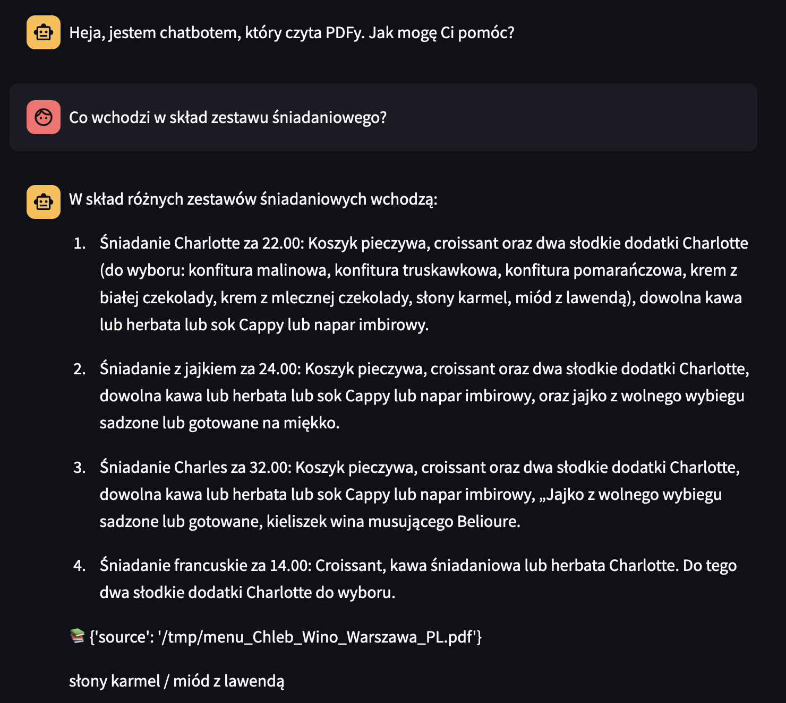
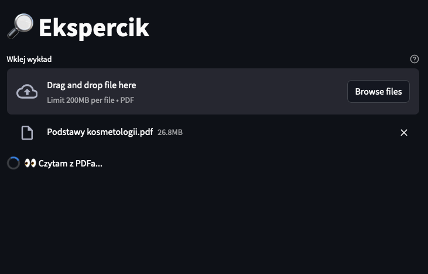

# Ekspercik

Ekspercik is a chat bot similar to ChatGPT that can answer based on provided PDFs.
It uses tesseract OCR to extract text from PDFs (also from images in PDFs) and then stores them persistently to Chroma.
Chat bot then uses this data to answer questions.

Since this was hacked in a day it has few rough edges.

It supports running against OpenAI LLMs such as GPT-4 or GPT-3.5-Turbo, as well as self hosted Ollama models.
I tested it with `gpt-4` and `mistral:7b` models. Models can be changed in a sidebar.

## Usage

Run it with streamlit:

```bash
streamlit run ekspercik.py
```

For now you will need to guess and install all the dependencies yourself 😕.

## Screenshots


